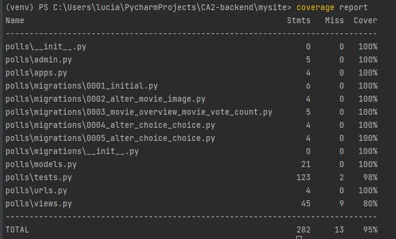

# CA3-backend
For our CA3-backend project, our task was to create a test class for an existing full stack web application using Python, Django, and MySQL, which could perform CRUD operations. Since we had already created such functionality in our previous assessments, we decided to extend our test class to test models and views due to time constraints.

While we did not have the opportunity to test APIs and Forms, we did install the coverage package to analyze the testing coverage and generate reports on our application. The coverage report showed that our application had achieved a 95% coverage.

To ensure that our testing was reliable and independent, we created and point, on the setting file, to a separate database to execute the test cases. This approach allowed us to test our application in isolation, without any interference from external factors.

---

- [x] Add manual testing using one of the unit test libraries and one or more module/function.
- [x] Add Automatic (Dynamic) testing using one of the unit test libraries and one or more module/function.
- [ ] Document the testing of the function and the assertions being used.
- [x] Ensure that the test include: positive and negative tests.
- [x] Configure the system with a config file for development and another for file test.
- [x] The application is accompanied by a short report or readme file explaining the testing methodology and coverage.
- [ ] Extend the web app to include at least 2 additional anti-haking security checks such as CSS, SQL injection, redirection

---

